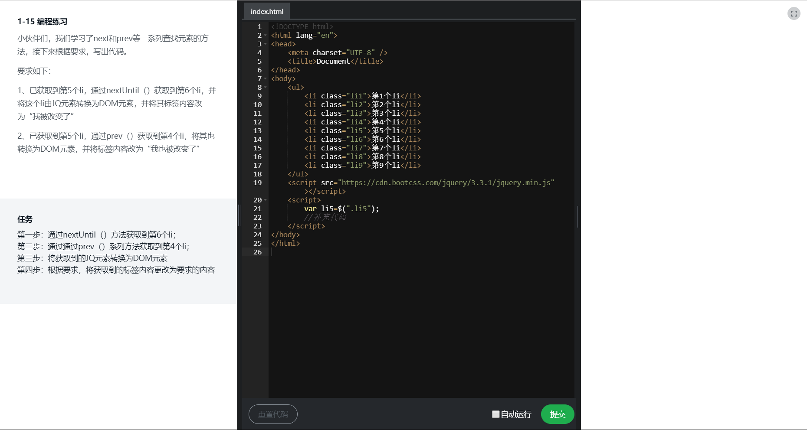
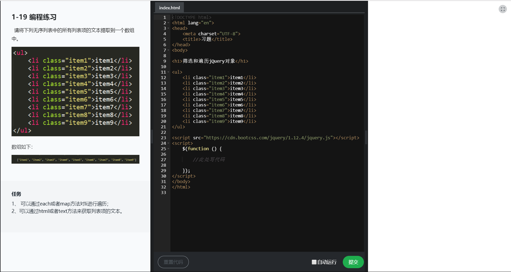

# jQuery DOM操作练习

## 1-1如何创建HTML

### DOM对象和jQuery对象的区别

> 1. 检测 DOM Object: 
```
    if ( obj.nodeType)
```
> 2. 检测 jQuery Object: 
```
    if (obj.jquery)
```
> 3. 转换：
```javascript
    var jqueryObj = $(domObj);
    var domObj = jqueryObj.get([index]);
```
### 如何创建元素
```javascript
    $('<div>hello</div>'),{
        设置属性
    }
```

## 1-3编程练习


## 1-6 检查和获取元素

>  无论是从html网页中的，还是自己通过js创建的，都可以，对jQuery对象集合做各种操作

### 检查元素数量
```javascript
    $('XXX').length
```
### 提取元素

> 对集合中某个元素进行操作，

> 1. [index] 返回DOM元素 -从数组中提取元素
```javascript
     $(function() {
        let ele = $('li');
        // 返回坐标为，0 的元素
        console.log(ele[0])

    })
```

> 2. get([index]) 返回DOM元素 -index可以省略，变成元素集合
```javascript
    $(function() {
            let ele = $('li');
            // 返回坐标为，0 的元素
            console.log(ele.get(0));
            // 以数组返回ele中的所有dom元素，
            console.log(ele.get());
            // index参数可以是负数，代表，从后向前获取元素
            console.log(ele.get(-1));
        })
```

> 3. eq(index) 通个索引值，返回jQuery对象
```javascript
    $(function() {
            let ele = $('li');
            // 返回坐标为，0 的元素
            console.log(ele.eq(0));
            // 不加索引，不会返回任何东西，与get()有区别
            console.log(ele.eq());  
            // eq筛选器 ,与eq()方法效果一样，但是性能没有方法高
            console.log($('li:eq()'));
            // eq()方法与get()方法一样，可以传负值
            console.log(ele.eq());
        })
```

> 4. first() 获取第一个元素
```javascript
    $(function() {
            let ele = $('li');
            // 获取第一个元素，（）里不用加参数
            console.log(ele.first());
        })
```

> 5. last() 获取最后一个元素
```javascript
    $(function() {
            let ele = $('li');
            // 获取第一个元素，（）里不用加参数
            console.log(ele.last());
       })
```

> 5. toArray() 把jQuery对象直接转换成dom元素数组
```javascript
    $(function() {
            let ele = $('li');
            // 把jQuery对象直接转换成dom元素数组 与get()方法不加参数一样
            console.log(ele.toArray());
       })
```


## 1-9 通过关系查找jQuery对象的方法(1)

> 知道一个对象，想要通过它来获取，所以对象的父类，或者子类

> 1. chidren([selector]) 选择一个对象的直接子元素
```javascript
    $(function () {
        // 选择id为box下的所有，div直接子元素，但是，不能选着文本节点
        var ele = $('#box').children('div')
        // 与children()方法，效果一样。的类选择器
        var ele2 =  $('#box > *')

    })
```

> 2. contents() 选择一个对象的直接子元素，返回文本节点
```javascript
    $(function () {
        // 选择id为box下的所有，div直接子元素，与，所有文本节点
        var ele = $('#box').contents('div')
        
    })
```

> 3. find(selecor) 通过选择器，来筛选，其中的后代元素（包含子元素，与孙子元素）
```javascript
    $(function () {
        // 选择id为box下的所有，div子元素，与孙子元素，
        var ele = $('#box').find('div')
        
    })
```

> 4. parent([selecor]) 获取当前匹配元素集合中的每个元素的父元素

> 5. parents([selecor]) 获取当前匹配元素集合中的每个元素的所有父元素

> 6. parentsUntil([selector]) 获取当前匹配元素集合中的每个元素的祖先元素，直到遇到被选择器（该方法的参数）匹配的元素为止

> 7. closest(selecor) 从当前元素开始逐级向上寻找，返回最先匹配的元素，也能获取到它本身。
```
    1. closest是从当前元素开始匹配的，parents是从父元素开始匹配的。
    2. closest向上，找到匹配的就停止；parents会找到所有的父元素，并返回一个集合。
```

## 1-14 通过关系查找jQuery对象的方法(2)

> 1. next([selector]) 查找下一个同类级的列表项
```javascript
    $(function () {
        // 找到同类型的下一个元素列表的.item5
        console.log($('.item4').next('li'))
    })
```

> 2. nextAll([selector]) 找到同类级的下一个全部元素
```javascript
    $(function () {
        // 找到同类型的下一个元素列表的.item5 ~.itme9
        console.log($('.item4').nextAll('li'))
    })
```

> 3. nextUntil([selector]) 按条件查找，不包括，本身的所有以后的同类级元素
```javascript
    $(function () {
        // 找到同类型的下一个元素列表的.item5 ~.itme6
        console.log($('.item4').nextUntil('.item7'))
    })
```

> 4. prev([selector]) 查找上一个同类级的列表项

> 5. prevAll([selector]) 找到同类级的下一个全部元素

> 6. prevUntil([selector])

> 7. siblings([selector]) 找到一个元素的同类集合，不包含它本身

## 1-15 编程练习



## 1-16 筛选和遍历jQuery对象

### 添加元素

> add(selector)
```javascript
    $(function () {
        // 把item1，与item2 连接
        console.log($('.item1 , .item2'))
        // 
        console.log($('.item1').add('.item2'))   
    })
```

### 过滤元素

> not(selector) 删除selector元素
```javascript
    $(function () {
        // 不要item4 元素
        console.log($('li').not('.item4')) 
    })
```

> filter(selector) 保留selector元素
```javascript
    $(function () {
        // 只保留item4元素
        console.log($('li').filter('.item4')) 
    })
```

> not() 与 filter() 的参数还可以是一个函数的返回值
```javascript
    $(function () {
        // 通过函授返回的.item2来保留文件
        console.log($('li').filter(function(index) {
            return $(this).hasClass('item2')
        })) ;
        console.log($('li').not(function(index) {
            return $(this).hasClass('item2')
        })) ;
    })

```

> has (selector) 保留有特定后代的元素
```javascript
    $(function () {
        // 保留后代有ul元素的选项
        console.log($('li').has('ul')) 
    })
```

### 获取子集 ：类似数组，通过索引的的方式，来获取元素

> slice(start[,end]) 通过开始，和结束的位置来获取元素
```javascript
    $(function () {
        // 获取，[3, 5) 区间的元素
        console.log($('li').slice(3, 5)) 
    })
```

### 转换元素

> map(callback) 将jQuery对象，转换成另一个jQuery对象
```javascript
    $(function () {
        // 
        console.log($('div').map(function(index, domElement) {
            return 
        })) 
    })
```

### 遍历元素

> each(iterator) 遍历元素

## 1-19 编程练习

