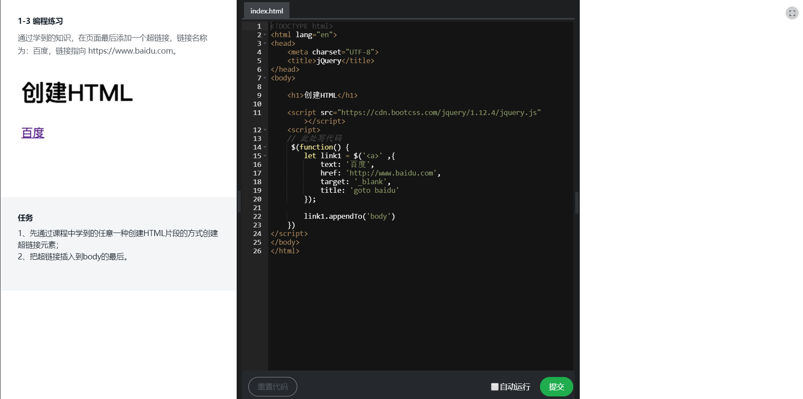

# jQuery DOM操作练习

## 1-1如何创建HTML

### DOM对象和jQuery对象的区别

> 1. 检测 DOM Object: 
```
    if ( obj.nodeType)
```
> 2. 检测 jQuery Object: 
```
    if (obj.jquery)
```
> 3. 转换：
```javascript
    var jqueryObj = $(domObj);
    var domObj = jqueryObj.get([index]);
```
### 如何创建元素
```javascript
    $('<div>hello</div>'),{
        设置属性
    }
```
## 1-3编程练习



## 1-6 检查和获取元素

>  无论是从html网页中的，还是自己通过js创建的，都可以，对jQuery对象集合做各种操作

### 检查元素数量
```javascript
    $('XXX').length
```
### 提取元素

> 对集合中某个元素进行操作，

> 1. [index] 返回DOM元素 -从数组中提取元素
```javascript
     $(function() {
        let ele = $('li');
        // 返回坐标为，0 的元素
        console.log(ele[0])

    })
```

> 2. get([index]) 返回DOM元素 -index可以省略，变成元素集合
```javascript
    $(function() {
            let ele = $('li');
            // 返回坐标为，0 的元素
            console.log(ele.get(0));
            // 以数组返回ele中的所有dom元素，
            console.log(ele.get());
            // index参数可以是负数，代表，从后向前获取元素
            console.log(ele.get(-1));
        })
```

> 3. eq(index) 通个索引值，返回jQuery对象
```javascript
    $(function() {
            let ele = $('li');
            // 返回坐标为，0 的元素
            console.log(ele.eq(0));
            // 不加索引，不会返回任何东西，与get()有区别
            console.log(ele.eq());  
            // eq筛选器 ,与eq()方法效果一样，但是性能没有方法高
            console.log($('li:eq()'));
            // eq()方法与get()方法一样，可以传负值
            console.log(ele.eq());
        })
```

> 4. first() 获取第一个元素
```javascript
    $(function() {
            let ele = $('li');
            // 获取第一个元素，（）里不用加参数
            console.log(ele.first());
        })
```

> 5. last() 获取最后一个元素
```javascript
    $(function() {
            let ele = $('li');
            // 获取第一个元素，（）里不用加参数
            console.log(ele.last());
       })
```

> 5. toArray() 把jQuery对象直接转换成dom元素数组
```javascript
    $(function() {
            let ele = $('li');
            // 把jQuery对象直接转换成dom元素数组 与get()方法不加参数一样
            console.log(ele.toArray());
       })
```